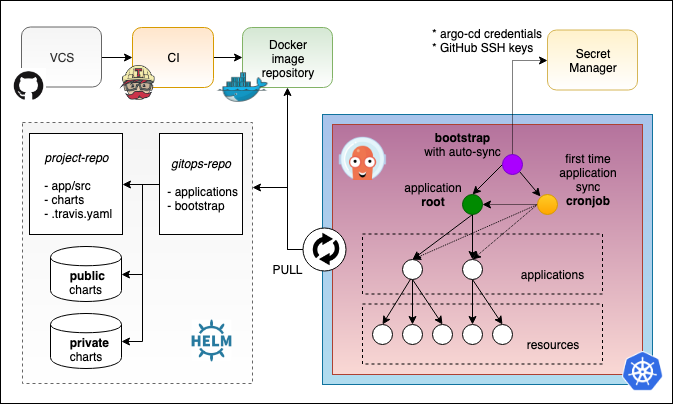

# gitops-k8s

## Introduction

### TL;DR

* Kubernetes is a declarative system
* Git can be used to describe infrastructure and software deployment
* GitOps is a way to do Continuous Delivery and operate Kubernetes via Git pull request
* GitOps empowers developers to do operations

### Imperative vs Declarative

In an imperative system, the user knows the desired state, determines the sequence of commands to transition the system to the desired state and supplies a representation of the commands to the system.

By contrast, in a declarative system, the user knows the desired state, supplies a representation of the desired state to the system, then the system reads the current state and determines the sequence of commands to transition the system to the desired state.

Declarative systems have the distinct advantage of being able to react to unintended state changes without further supervision. In the event of an unintended state change leading to a state drift, the system may autonomously determine and apply the set of mitigating actions leading to a state match. This process is called a *control loop*, a popular choice for the implementation of controllers.

### What is GitOps?

GitOps is the art and science of using Git pull requests to manage infrastructure provisioning and software deployment

The concept of GitOps originated at Weaveworks, whose developers described how they use Git to create a *single source of truth*.

Kubernetes is a *declarative* system and by using declarative tools, the entire set of configuration files can be version controlled in Git. More generally, GitOps is a way to do Continuous Delivery and operate Kubernetes via Git.

## Argo CD

### Push vs Pull

TODO

### Setup

TODO

### Alternatives

TODO

* jenkins
* Rancher vs Spinnaker

## Resources

* [Imperative vs Declarative](https://medium.com/@dominik.tornow/imperative-vs-declarative-8abc7dcae82e)
* [GitOps - Operations by Pull Request](https://www.weave.works/blog/gitops-operations-by-pull-request) (Part 1)
* [The GitOps Pipeline](https://www.weave.works/blog/the-gitops-pipeline) (Part 2)
* [GitOps - Observability](https://www.weave.works/blog/gitops-part-3-observability) (Part 3)
* [GitOps - Application Delivery Compliance and Secure CICD](https://www.weave.works/blog/gitops-compliance-and-secure-cicd) (Part 4)
* [kubediff](https://github.com/weaveworks/kubediff)
* [What Is GitOps Really?](https://www.weave.works/blog/what-is-gitops-really)
* [GitOps 101: What Is GitOps, and Why Would You Use It?](https://www.twistlock.com/2018/08/06/gitops-101-gitops-use)
* [GitOps: Dev, with a Dash of Ops!](https://www.cloudbees.com/blog/gitops-dev-dash-ops)
* [GitOps](https://www.weave.works/technologies/gitops)
* [GitOps for Kubernetes](https://thenewstack.io/gitops-kubernetes-devops-iteration-focused-declarative-infrastructure)
* [Automating continuous delivery with Kubernetes, Google Cloud and Git](https://vimeo.com/255633066)
* [Continuous Delivery the Hard Way](https://www.weave.works/blog/continuous-delivery-the-hard-way)
* [GitOps: High velocity CICD for Kubernetes](https://www.weave.works/blog/gitops-high-velocity-cicd-for-kubernetes)
* [Introducing Argo CD](https://blog.argoproj.io/introducing-argo-cd-declarative-continuous-delivery-for-kubernetes-da2a73a780cd)
* [Argo CD - Declarative Continuous Delivery for Kubernetes](https://argoproj.github.io/argo-cd)

## Contributors

Thanks to [@conorfennell](https://github.com/conorfennell) and [@mduarte](https://github.com/mduarte) to envision this path, lie down the foundation of this project and promote GitOps in our teams!
